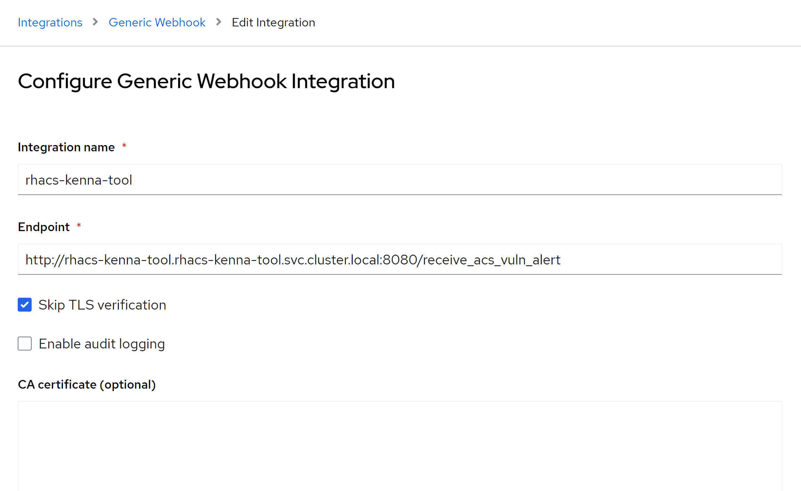
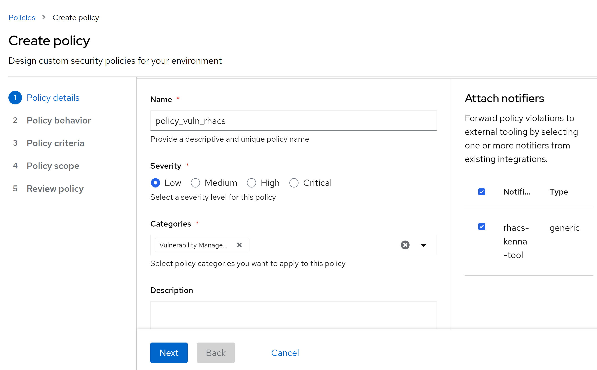
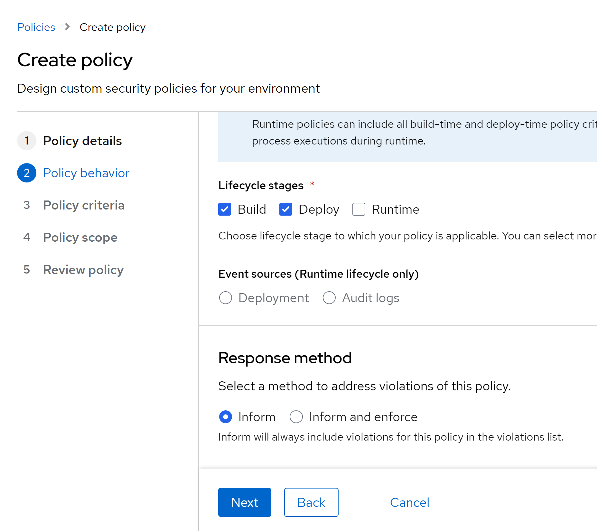
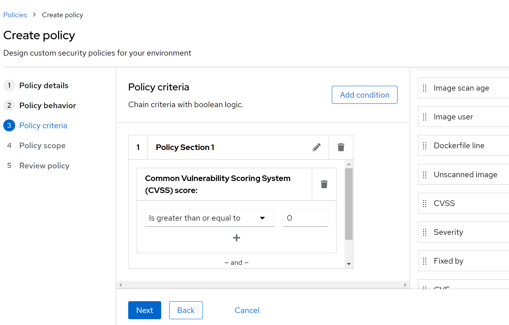
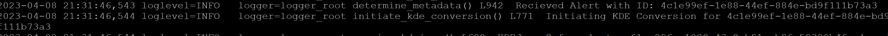

# RHACS-Kenna-Integration
Red Hat ACS Integration for exporting vulnerability Information with KENNAfrom RHACS into Kenna KDE Format.

## Status: Working

### Purpose
Repo provides an example python application that will recieve a [Red Hat Advanced Cluster Security Policy Violation for Vulnerabilities](https://www.redhat.com/en/technologies/cloud-computing/openshift/advanced-cluster-security-kubernetes) via [Webhook](https://docs.openshift.com/acs/3.74/integration/integrate-using-generic-webhooks.html) and convert it to my closest approximation of the [Kenna Json Format](https://help.kennasecurity.com/hc/en-us/articles/360026413111-Kenna-Data-Importer-JSON-Connector-). Output will be written to a json file which can be imported by Kenna.

### How does it work
Application is written with the [FastApi framework](https://fastapi.tiangolo.com/).Application will run as an async non-blocking loop, recieveing violations from RHACS and converting to KDE Json Files(At present one file per cluster).Please see [config file](./app/config.py) to see settings that change application behaviour. At present application has to maintain vulnerability state in memory so a restart can lead to temporary inconsistencies until new alerts are recieved from RHACS.

### What is not included
- Application does not handle horizontal scaling at the moment.

### Pre-Requisites
- Python 3.10
- A file location that the Kenna Platform can read from

### How to run locally
- git clone this repo
- pip install -r ./app/requirements.txt
- python ./run.py
- Point [ACS WebHook](https://docs.openshift.com/acs/3.74/integration/integrate-using-generic-webhooks.html) to use Configured Ip/Port in [run.py](./run.py)

### How to deploy Application in OpenShift Container Platform.

- Run deployment command.
   ```bash
   oc apply -k ./deploy-ocp/
   ```

### Configure RHACS Integration
- Configure Webhook Notifier in RHACS
  - Under Platform Configuration -> Integrations -> Notifier Integrations -> Generic Webhook
  - Select New Integration
  - Configure Integration, see example below
    
  - Testing the integration might generate - "Received error response from webhook: 422. Check central logs for full error.: invalid arguments". This is expected and is because the application cannot parse the test message.
  
- Configure RHACS Policy with 
  - Under Platform Configuration -> Policy Management -> Create Policy

  - Create Policy and enable notification to our RHACS notifier. See example below:
    

  - Add Policy Stages.Choose stages that will work for your requirements. See example below:
  

  - Add Policy Vulnerability Requirements that match your requirements. Example below will capture based on vulnerability CVSS:
  
   
  - Complete policy creation.

- We can confirm policy information being passed to our application from the logs.
  - Get Application logs
    ```bash
    oc logs -f $(oc get pod -n rhacs-kenna-tool -l app=rhacs-kenna-tool -o name) -n rhacs-kenna-tool
    ```
  - We should start seeing alerts recieved from RHACS in our logs.
    

- Copy the KDE Output files locally
  - Use Rsync
    ```bash
    oc rsync -n rhacs-kenna-tool $(oc get pod -n rhacs-kenna-tool -l app=rhacs-kenna-tool -o name):/app/kde_output_json/ ./kenna_rsync
    ```   

## How to run tests locally
- pytest